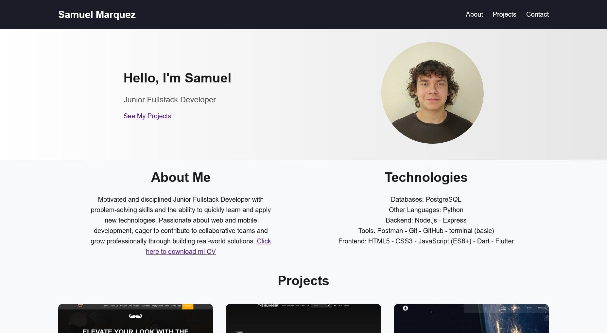

# 👋 Hi, I'm Samuel Márquez

Welcome to my GitHub portfolio!  
Here you’ll find a collection of projects where I showcase my **frontend, backend, and full-stack development skills**.  
I love building practical solutions, experimenting with new technologies, and improving my craft as a developer.  

---

## 🧑‍💻 About Me
- 🎯 Focused on **Fullstack development** with HTML, CSS, JavaScript, Node.js, and more.  
- 🚀 Interested in creating apps, tools, and digital products that solve real problems.  
- 📚 Constantly learning about **modern frameworks** and best practices in software engineering.  
- 🔍 Exploring freelancing, startups, and innovative projects to grow as a professional.  

---

## 🛠️ Tech Stack
- **Databases:** PostgreSQL 
- **Other Languages:** Python  
- **Backend:** Node.js, Express 
- **Tools:** Postman, Git, GitHub, terminal   
- **Frontend:** HTML5, CSS3, JavaScript (ES6+), Dart, Flutter 

---

## 🌍 Find Me Online
- 📧 Email: sammarquez833@outlook.com  
- 🌐 [Portfolio Website](https://samuelmarquez833.github.io/portfolio/)   

---

## 🔹 Project Preview

Here’s a quick look at one of my projects:  

---

⭐ If you like my work, feel free to star the repos or reach out for collaboration!  
